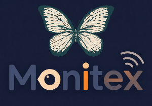

# Monitex — Intelligent Smart-Home Telemetry & Anomaly Monitoring Platform

> Real-time smart-home monitoring powered by IoT edge devices, streaming pipelines, anomaly detection, and a modern web dashboard.

<p align="center">
   
</p>

[](#)
[](#)
[](#)
[](#)

---

## 🚀 Project Preview


> _Using the official login-page logo. Replace this section later with a full dashboard screenshot if needed._

---

## ✨ Why Monitex

Monitex is an end-to-end observability platform for smart-home environments. It connects edge devices to a resilient backend pipeline, detects anomalies with ML, and surfaces actionable insights in real time.

### Core strengths
- **Real-time device and sensor monitoring**
- **Streaming-first ingestion architecture** (MQTT + AMQP + InfluxDB)
- **Anomaly detection integration** via Python ML model pipeline
- **Live updates** to clients through SignalR
- **Modular full-stack design** for rapid extension

---

## 🧱 Architecture

Monitex is organized as a multi-layer system:

1. **Edge Layer (`edge/`)**
   - ESP32 firmware and simulation scripts
   - Emits health and sensor telemetry over MQTT

2. **Ingestion & Messaging Layer (`Backend/`)**
   - Consumes MQTT events
   - Bridges events through AMQP/RabbitMQ consumers
   - Dispatches sensor data for storage and downstream processing

3. **Data & Processing Layer (`Backend/` + `monitex-ai/`)**
   - Time-series storage in InfluxDB
   - Relational metadata in PostgreSQL
   - AI anomaly model for intelligent event detection

4. **Presentation Layer (`Front-Web/`)**
   - Angular dashboard for real-time monitoring
   - Device/sensor management APIs
   - Authentication-enabled user workflows

### Architecture Diagram (Placeholder)

<!-- TODO: Replace with real architecture diagram -->


> _Placeholder: include a system diagram showing Edge → MQTT → AMQP → Services → DB/AI → Frontend._

---

## 📂 Repository Structure

```text
Monitex/
├── Backend/         # .NET backend APIs, messaging, services, and hubs
├── Front-Web/       # Angular web dashboard
├── edge/            # ESP32 code + telemetry simulation scripts
├── monitex-ai/      # ML training + anomaly model artifacts
├── queries/         # SQL and utility scripts
└── tests/           # Test suites and QA assets
```

---

## 🛠 Tech Stack

- **Backend:** ASP.NET Core, SignalR, RabbitMQ/AMQP, MQTT
- **Databases:** InfluxDB (time-series), PostgreSQL (relational)
- **Frontend:** Angular
- **Edge:** ESP32 (Rust + simulation scripts)
- **AI/ML:** Python, scikit-learn, joblib

---

## ⚡ Quick Start

### 1) Clone
```bash
git clone <your-repo-url>
cd Monitex
```

### 2) Backend
```bash
cd Backend
# Configure appsettings.Development.json for Postgres/Influx/RabbitMQ/MQTT
# dotnet restore
# dotnet run
```

### 3) Frontend
```bash
cd Front-Web
npm install
npm start
```

### 4) Edge simulation (optional)
```bash
cd edge
# Example simulation scripts
./esp32_simulation.sh
```

### 5) AI model workflow (optional)
```bash
cd monitex-ai
# python train_model.py
```

### 6) Dockerized full stack (recommended for local integration)
```bash
docker compose up --build -d
```

Stop and remove containers:
```bash
docker compose down
```

Stop and remove containers + named volumes:
```bash
docker compose down -v
```

Exposed service endpoints:
- Frontend: `http://localhost:4200`
- Backend API: `http://localhost:5020`
- RabbitMQ AMQP: `localhost:5672`
- RabbitMQ Management UI: `http://localhost:15672`
- Mosquitto MQTT: `localhost:1883`
- PostgreSQL: `localhost:5432`
- InfluxDB: `http://localhost:8086`

Docker stack files added:
- `docker-compose.yml`
- `Backend/Dockerfile`
- `Front-Web/Dockerfile`
- `monitex-ai/Dockerfile`
- `mosquitto/mosquitto.conf`

> The Docker Compose setup keeps the same queue names, routing keys, and credentials defined in `Backend/appsettings.json`, while replacing localhost hostnames with Docker service names internally.
> It also runs `monitex-ai` as a RabbitMQ anomaly-consumer service using `iot.sensors.anomaly.queue` and publishing anomaly events to `sensor.anomaly.detected`.

---

## 🔐 Configuration

Before running in development, configure these integration points:
- MQTT broker
- RabbitMQ/AMQP broker
- InfluxDB instance
- PostgreSQL database
- Frontend API base URL

Primary config entry points:
- `Backend/appsettings.Development.json`
- `Backend/config/`
- `Backend/settings/`

### Network access matrix

Use these hostnames depending on where the caller runs:

| Service | From browser on host | From another Docker container | From ESP32 / external |
|---|---|---|---|
| Frontend | `http://localhost:4200` | `http://frontend:4200` | use host LAN IP or hostname |
| Backend API / SignalR | `http://localhost:5020` | `http://backend:5020` | use host LAN IP or hostname + port 5020 |
| RabbitMQ AMQP | `localhost:5672` | `rabbitmq:5672` | not exposed externally |
| RabbitMQ UI | `http://localhost:15672` | `http://rabbitmq:15672` | use host LAN IP, port 15672 |
| Mosquitto MQTT | `localhost:1883` | `mosquitto:1883` or `mqtt-broker:1883` | use host LAN IP or hostname, port 1883 |
| PostgreSQL | `localhost:5432` | `postgres:5432` | not exposed externally |
| InfluxDB | `http://localhost:8086` | `http://influxdb:8086` | not exposed externally |
| monitex-ai | no direct host port | `monitex-ai` (internal only) | not used |

### Finding your machine's hostname for ESP32

To find hostnames that ESP32 can use to reach the Mosquitto broker on your host:

```bash
# Find your LAN IP (use this if hostname resolution fails)
hostname -I
# Output example: 192.168.1.50 172.17.0.1

# Find your machine hostname
hostname
# Output example: martell0x1

# Try mDNS resolution (if supported on your network)
hostname -A
# Or just append .local to your hostname: martell0x1.local
```

For ESP32 to reach Mosquitto:
- Use the IP from `hostname -I` (pick the non-loopback, non-docker-bridge one)
- Or use your machine hostname + `.local` for mDNS (e.g., `martell0x1.local:1883`)
- Or add a static DNS entry on your ESP32 / network

### Setting up .env for your environment

Copy `.env.example` to `.env` and update with your machine's actual hostname or LAN IP:

```bash
cp .env.example .env
# Edit .env and set MQTT_BROKER_HOST to your machine's IP or hostname
```

This value is optional—the Docker Compose stack works without it. Use `.env` if you want to document your specific network setup.

---

## 🧪 Testing

### Frontend app
```bash
cd Front-Web
npm test
```

To open the Angular frontend in a browser while the Docker stack is running, visit:
- http://localhost:4200

### Dashboard test page
This repo also includes a simple SignalR test page under tests/dashboard-test.

```bash
cd tests/dashboard-test
npm install
npm start
```

Then open:
- http://localhost:3000

The test page connects to the backend SignalR hub at:
- http://localhost:5020/sensorHub

> Add backend integration/unit test commands here as your test suite evolves.

---

## 🗺 Roadmap

- [ ] Replace placeholders with production screenshots and architecture diagram
- [x] Add Docker/Docker Compose local environment
- [ ] Add CI pipeline (build + test + lint)
- [ ] Expand observability (metrics, tracing, alerting)
- [ ] Harden auth and role-based access controls

---

## 🤝 Contributing

Contributions are welcome. Open an issue for major changes and submit PRs with a clear scope and test evidence.

---

## 📄 License

Add your project license here (e.g., MIT, Apache-2.0, proprietary).

---

## 📬 Contact

For collaboration, architecture discussions, or integration support, open an issue in this repository.
