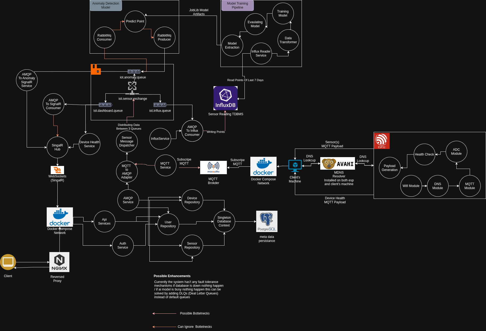

# Monitex — An End-to-End Event-Driven IoT Monitoring & Anomaly Detection Suite

  

> A high-throughput, event-driven ecosystem leveraging MQTT and AMQP for resilient sensor data orchestration and real-time analysis.

  

<div align="center">
	  
</div>

<p align="center">

</p>
<p align="center">
  <!-- Frontend -->
  
  
  
  
  
  
</p>
<p align="center">
  <!-- Backend -->
  
  
  
  
  
  
  
</p>
<p align="center">
  <!-- Edge / IoT -->
  
  
  
</p>
<p align="center">
  <!-- AI / ML -->
  
  
  
</p>

<p align="center">
  <!-- Scripting / DevOps -->
  
</p>
  <p align="center">
  ⭐️ If you like this project, don’t forget to give it a **star** on GitHub! ⭐️
</p>

---

# Overview
**Monitex** is an enterprise-grade, distributed IoT ecosystem designed to bridge the gap between physical hardware and actionable digital insights. Unlike traditional monolithic IoT setups, Monitex utilizes an **Event-Driven Architecture (EDA)** to decouple data ingestion, processing, and visualization, ensuring high availability and system resilience.

At its core, the project facilitates the journey of a data point from a "dumb" sensor reading to a "smart" anomaly alert through a multi-stage pipeline:

### The Edge Layer (IoT & Ingestion)

The system begins at the hardware level with **ESP32 microcontrollers** acting as edge devices. These devices collect environmental telemetry and communicate via the **MQTT protocol**. To ensure local discovery and seamless connectivity, the edge layer leverages **mDNS (Avahi)**, allowing devices to find the central broker without hardcoded IP addresses.

### The Orchestration Layer (Middleware)

Data flows through a dual-broker system designed for maximum reliability:

- **Mosquitto (MQTT):** Handles the high-frequency, lightweight communication from edge devices.
    
- **RabbitMQ (AMQP):** Acts as the central nervous system. An "MQTT-to-AMQP" adapter bridge translates edge messages into robust, persistent queues. This allows the system to handle **backpressure**, ensuring that if the database or AI model is busy, no data is lost.
    

### The Intelligence Layer (Processing & Storage)

Monitex treats data as two distinct assets:

- **Hot Data (Real-time):** Streamed instantly via **SignalR** to the web dashboard for sub-second updates.
    
- **Cold Data (Historical):** Persisted in **InfluxDB**, a high-performance time-series database optimized for sensor telemetry.
    
- **Predictive Layer:** An **Anomaly Detection Pipeline** consumes historical windows of data to train models and predict potential system failures or "out-of-bound" events before they occur.
    

### The Control Plane (Backend & UI)

The backend is built on a **modern .NET core** using a **Repository Pattern** and **Clean Architecture** principles. By avoiding heavy ORMs in favor of high-performance data access, the system maintains a low memory footprint even under heavy load. The entire infrastructure is containerized via **Docker**, providing a "one-click" deployment experience from development to production.

  

---

  

## ✨ Why Monitex

  

Monitex is an end-to-end observability platform for smart-home environments. It connects edge devices to a resilient backend pipeline, detects anomalies with ML, and surfaces actionable insights in real time.


### Core strengths

- **Real-time device and sensor monitoring**

- **Streaming-first ingestion architecture** (MQTT + AMQP + InfluxDB)

- **Anomaly detection integration** via Python ML model pipeline

- **Live updates** to clients through SignalR

- **Modular full-stack design** for rapid extension

  

---

  

## 🧱 Architecture

  

Monitex is organized as a multi-layer system:

  

1. **Edge Layer (`edge/`)**

- ESP32 firmware and simulation scripts

- Emits health and sensor telemetry over MQTT

  

2. **Ingestion & Messaging Layer (`Backend/`)**

- Consumes MQTT events

- Bridges events through AMQP/RabbitMQ consumers

- Dispatches sensor data for storage and downstream processing

  

3. **Data & Processing Layer (`Backend/` + `monitex-ai/`)**

- Time-series storage in InfluxDB

- Relational metadata in PostgreSQL

- AI anomaly model for intelligent event detection

  

4. **Presentation Layer (`Front-Web/`)**

- Angular dashboard for real-time monitoring

- Device/sensor management APIs

- Authentication-enabled user workflows

  

### Architecture Diagram
<div align="center">
	
</div> 

  

---

  

## 📂 Repository Structure

  

```text

Monitex/

├── Backend/ # .NET backend APIs, messaging, services, and hubs

├── Front-Web/ # Angular web dashboard

├── edge/ # ESP32 code + telemetry simulation scripts

├── monitex-ai/ # ML training + anomaly model artifacts

├── queries/ # SQL and utility scripts

└── tests/ # Test suites and QA assets

```

  

---

  

## 🛠 Tech Stack

  

- **Backend:** ASP.NET Core, SignalR, RabbitMQ/AMQP, MQTT

- **Databases:** InfluxDB (time-series), PostgreSQL (relational)

- **Frontend:** Angular

- **Edge:** ESP32 (Rust + simulation scripts)

- **AI/ML:** Python, scikit-learn, joblib

  

---

  

## ⚡ Quick Start

  

### 1) Clone

```bash

git clone <your-repo-url>

cd Monitex

```

  

### 2) Backend

```bash

cd Backend

# Configure appsettings.Development.json for Postgres/Influx/RabbitMQ/MQTT

# dotnet restore

# dotnet run

```

  

### 3) Frontend

```bash

cd Front-Web

npm install

npm start

```

  

### 4) Edge simulation (optional)

```bash

cd edge

# Example simulation scripts

./esp32_simulation.sh

```

  

### 5) AI model workflow (optional)

```bash

cd monitex-ai

# python train_model.py

```

  

### 6) Dockerized full stack (recommended for local integration)

```bash

docker compose up --build -d

```

  

Stop and remove containers:

```bash

docker compose down

```

  

Stop and remove containers + named volumes:

```bash

docker compose down -v

```

  

Exposed service endpoints:

- Frontend: `http://localhost:4200`

- Backend API: `http://localhost:5020`

- RabbitMQ AMQP: `localhost:5672`

- RabbitMQ Management UI: `http://localhost:15672`

- Mosquitto MQTT: `localhost:1883`

- PostgreSQL: `localhost:5432`

- InfluxDB: `http://localhost:8086`

  

Docker stack files added:

- `docker-compose.yml`

- `Backend/Dockerfile`

- `Front-Web/Dockerfile`

- `monitex-ai/Dockerfile`

- `mosquitto/mosquitto.conf`

  

> The Docker Compose setup keeps the same queue names, routing keys, and credentials defined in `Backend/appsettings.json`, while replacing localhost hostnames with Docker service names internally.

> It also runs `monitex-ai` as a RabbitMQ anomaly-consumer service using `iot.sensors.anomaly.queue` and publishing anomaly events to `sensor.anomaly.detected`.

  

---

  

## 🔐 Configuration

  

Before running in development, configure these integration points:

- MQTT broker

- RabbitMQ/AMQP broker

- InfluxDB instance

- PostgreSQL database

- Frontend API base URL

  

Primary config entry points:

- `Backend/appsettings.Development.json`

- `Backend/config/`

- `Backend/settings/`

  

### Network access matrix

  

Use these hostnames depending on where the caller runs:

  

| Service | From browser on host | From another Docker container | From ESP32 / external |

|---|---|---|---|

| Frontend | `http://localhost:4200` | `http://frontend:4200` | use host LAN IP or hostname |

| Backend API / SignalR | `http://localhost:5020` | `http://backend:5020` | use host LAN IP or hostname + port 5020 |

| RabbitMQ AMQP | `localhost:5672` | `rabbitmq:5672` | not exposed externally |

| RabbitMQ UI | `http://localhost:15672` | `http://rabbitmq:15672` | use host LAN IP, port 15672 |

| Mosquitto MQTT | `localhost:1883` | `mosquitto:1883` or `mqtt-broker:1883` | use host LAN IP or hostname, port 1883 |

| PostgreSQL | `localhost:5432` | `postgres:5432` | not exposed externally |

| InfluxDB | `http://localhost:8086` | `http://influxdb:8086` | not exposed externally |

| monitex-ai | no direct host port | `monitex-ai` (internal only) | not used |

  

### Finding your machine's hostname for ESP32

  

To find hostnames that ESP32 can use to reach the Mosquitto broker on your host:

  

```bash

# Find your LAN IP (use this if hostname resolution fails)

hostname -I

# Output example: 192.168.1.50 172.17.0.1

  

# Find your machine hostname

hostname

# Output example: martell0x1

  

# Try mDNS resolution (if supported on your network)

hostname -A

# Or just append .local to your hostname: martell0x1.local

```

  

For ESP32 to reach Mosquitto:

- Use the IP from `hostname -I` (pick the non-loopback, non-docker-bridge one)

- Or use your machine hostname + `.local` for mDNS (e.g., `martell0x1.local:1883`)

- Or add a static DNS entry on your ESP32 / network

  

### Setting up .env for your environment

  

Copy `.env.example` to `.env` and update with your machine's actual hostname or LAN IP:

  

```bash

cp .env.example .env

# Edit .env and set MQTT_BROKER_HOST to your machine's IP or hostname

```

  

This value is optional—the Docker Compose stack works without it. Use `.env` if you want to document your specific network setup.

  

---

  

## 🧪 Testing

  

### Frontend app

```bash

cd Front-Web

npm test

```

  

To open the Angular frontend in a browser while the Docker stack is running, visit:

- http://localhost:4200

  

### Dashboard test page

This repo also includes a simple SignalR test page under tests/dashboard-test.

  

```bash

cd tests/dashboard-test

npm install

npm start

```

  

Then open:

- http://localhost:3000

  

The test page connects to the backend SignalR hub at:

- http://localhost:5020/sensorHub

  

---

  

## 🤝 Contributing

  

Contributions are welcome. Open an issue for major changes and submit PRs with a clear scope and test evidence.

  

---

  

## 📄 License

  
> this project is licensed under MIT license


---

## 📬 Contact

For collaboration, architecture discussions, or integration support, open an issue in this repository.

